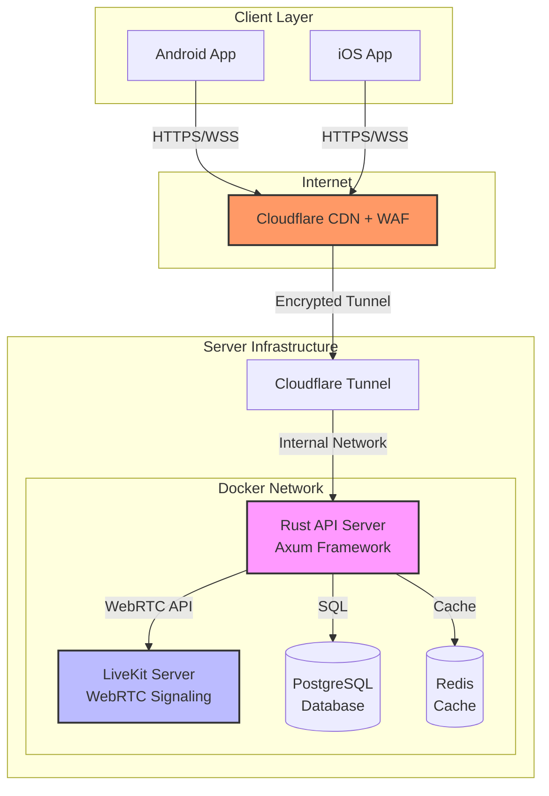
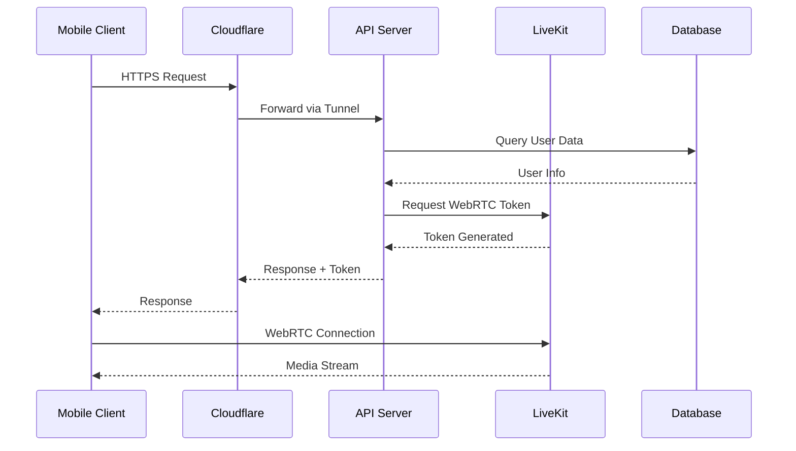
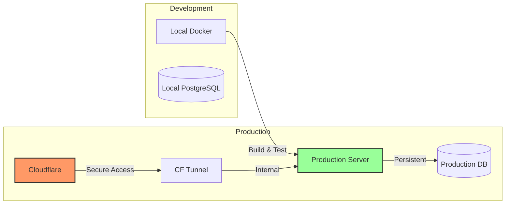
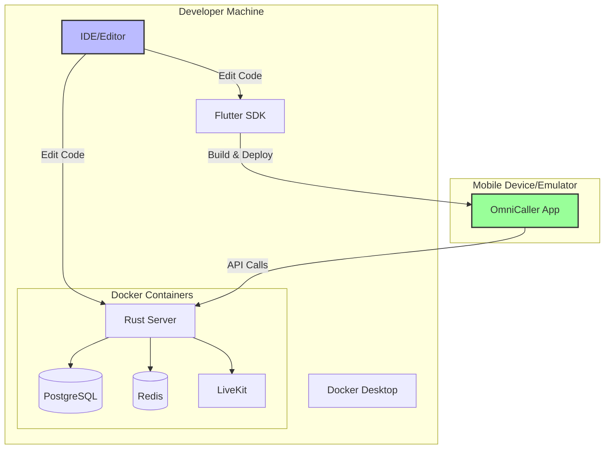

# OmniCaller

Real-time communication platform with WebRTC support for audio and video calling.

## Table of Contents

- [Overview](#overview)
- [Architecture](#architecture)
- [Features](#features)
- [Project Structure](#project-structure)
- [Getting Started](#getting-started)
- [Technology Stack](#technology-stack)
- [Development](#development)
- [Deployment](#deployment)
- [Documentation](#documentation)
- [Contributing](#contributing)
- [License](#license)

## Overview

OmniCaller is a full-stack real-time communication platform that enables high-quality audio and video calling. The platform consists of:

- **Backend Server**: Rust-based API server with WebRTC signaling through LiveKit
- **Mobile Client**: Flutter cross-platform application for iOS and Android

## Architecture

### System Architecture



### Communication Flow



## Features

### Backend Server

- RESTful API with Axum framework
- WebRTC signaling via LiveKit integration
- PostgreSQL database with Sea-ORM
- Redis caching layer
- Cloudflare Tunnel for secure public access
- Docker containerization
- Automated health checks
- Production-ready deployment

### Mobile Client

- Cross-platform support (iOS and Android)
- Real-time audio/video calling
- WebRTC peer-to-peer communication
- Material Design UI
- Optimized performance
- Offline capability

## Project Structure

```txt
OmniCaller/
├── server/                           # Backend server (Rust)
│   ├── src/                          # Rust source code
│   ├── migrations/                   # Database migrations
│   ├── Dockerfile                    # Container configuration
│   ├── docker-compose.yml            # Service orchestration
│   ├── Makefile                      # Build commands
│   ├── setup.sh                      # Setup automation
│   └── README.md                     # Server documentation
├── client/                           # Mobile client (Flutter)
│   ├── lib/                          # Dart source code
│   ├── android/                      # Android native code
│   ├── ios/                          # iOS native code
│   ├── test/                         # Test files
│   ├── pubspec.yaml                  # Flutter dependencies
│   └── README.md                     # Client documentation
└── README.md                         # This file
```

## Getting Started

### Prerequisites

#### For Server Development

- Docker 24.0 or higher
- Docker Compose 2.20 or higher
- Make (optional, for convenience commands)
- Git

#### For Client Development

- Flutter SDK 3.24.5 or higher
- Dart SDK 3.5.4 or higher
- Android Studio (for Android development)
- Xcode 14.0+ (for iOS development, macOS only)

### Quick Start

#### 1. Clone Repository

```bash
git clone <repository-url>
cd OmniCaller
```

#### 2. Setup Server

```bash
cd server

# Automated setup (recommended)
./setup.sh

# Or manual setup
cp .env.example .env
# Edit .env with your configuration
docker-compose up -d
```

For detailed server setup, see [server/README.md](./server/README.md).

#### 3. Setup Client

```bash
cd client

# Install dependencies
flutter pub get

# Run on connected device
flutter run

# Or build release APK
flutter build apk --release
```

For detailed client setup, see [client/README.md](./client/README.md).

## Technology Stack

### Backend

| Technology | Purpose                 | Version |
| ---------- | ----------------------- | ------- |
| Rust       | Programming language    | 2021    |
| Axum       | Web framework           | 0.7     |
| PostgreSQL | Primary database        | 17      |
| Sea-ORM    | ORM and query builder   | Latest  |
| Redis      | Cache and session store | Latest  |
| LiveKit    | WebRTC signaling server | Latest  |
| Docker     | Containerization        | 24+     |
| Cloudflare | CDN and tunnel          | Latest  |

### Frontend

| Technology      | Purpose              | Version |
| --------------- | -------------------- | ------- |
| Flutter         | Mobile framework     | 3.24.5  |
| Dart            | Programming language | 3.5.4   |
| LiveKit Client  | WebRTC client SDK    | Latest  |
| Material Design | UI design system     | 3       |

### Infrastructure



## Development

### Server Development

```bash
cd server

# Start all services
make up

# View logs
make logs

# Run health check
./health-check.sh

# Rebuild after code changes
make rebuild-server

# Access server shell
make shell-server

# Run tests
docker exec omni-caller-server cargo test
```

### Client Development

```bash
cd client

# Run in debug mode
flutter run

# Hot reload: Press 'r' in terminal
# Hot restart: Press 'R' in terminal

# Run tests
flutter test

# Analyze code
flutter analyze

# Format code
flutter format .
```

### Local Development Environment



## Deployment

### Server Deployment

#### Production Checklist

- [ ] Configure production environment variables
- [ ] Set up Cloudflare Tunnel
- [ ] Generate secure secrets (JWT, database passwords)
- [ ] Configure database backups
- [ ] Set up monitoring and logging
- [ ] Enable Cloudflare WAF
- [ ] Configure rate limiting
- [ ] Review security settings

#### Deploy Command

```bash
cd server

# Set production environment
export APP_ENV=production

# Start production services
make prod

# Verify deployment
./health-check.sh
```

For detailed deployment guide, see [server/DEPLOYMENT_SUMMARY.md](./server/docs/DEPLOYMENT_SUMMARY.md).

### Client Deployment

#### Android

**Release APK for Testing:**

```bash
cd client
flutter build apk --release
# Output: build/app/outputs/flutter-apk/app-release.apk
```

**App Bundle for Google Play:**

```bash
flutter build appbundle --release
# Output: build/app/outputs/bundle/release/app-release.aab
```

#### iOS

**Release Build:**

```bash
flutter build ios --release
```

**App Store Package:**

```bash
flutter build ipa --release
# Output: build/ios/ipa/
```

For detailed build instructions, see [client/README.md](./client/README.md).

## Documentation

### Server Documentation

- [Server README](./server/README.md) - Complete server documentation
- [Quick Start Guide](./server/QUICKSTART.md) - Get started in 5 minutes
- [Docker Guide](./server/DOCKER_README.md) - Docker setup and management
- [Cloudflare Setup](./server/CLOUDFLARE_SETUP.md) - Tunnel configuration
- [Deployment Summary](./server/DEPLOYMENT_SUMMARY.md) - Production deployment

### Client Documentation

- [Client README](./client/README.md) - Complete client documentation
- [Flutter Documentation](https://docs.flutter.dev/) - Official Flutter docs
- [LiveKit Client SDK](https://docs.livekit.io/client-sdk-flutter/) - WebRTC integration

## Testing

### Server Tests

```bash
cd server
docker exec omni-caller-server cargo test
```

### Client Tests

```bash
cd client

# Unit tests
flutter test

# Integration tests
flutter test integration_test/

# Test coverage
flutter test --coverage
```

## Monitoring and Health Checks

### Server Health Check

```bash
cd server
./health-check.sh
```

This checks:

- API server endpoint
- Database connectivity
- Redis connection
- LiveKit server status
- Cloudflare Tunnel status

### Client Health

- Build verification: `flutter analyze`
- Runtime checks: Built-in error reporting
- Performance profiling: `flutter run --profile`

## Security

### Security Features

- End-to-end encrypted WebRTC connections
- Cloudflare WAF protection
- No direct port exposure (Cloudflare Tunnel)
- Environment-based secrets management
- Database access control
- Rate limiting
- HTTPS/WSS only communication

### Security Best Practices

1. Never commit `.env` files
2. Rotate secrets regularly
3. Use strong passwords (minimum 32 characters)
4. Enable 2FA on all cloud services
5. Review access logs regularly
6. Keep dependencies updated
7. Run security audits periodically

## Troubleshooting

### Server Issues

See [server/README.md#troubleshooting](./server/README.md#troubleshooting) for:

- Server not starting
- Database connection issues
- Cloudflare Tunnel problems
- Port conflicts

### Client Issues

See [client/README.md#troubleshooting](./client/README.md#troubleshooting) for:

- Build failures
- Flutter Doctor issues
- Dependency conflicts
- Platform-specific problems

## Contributing

We welcome contributions to OmniCaller. Please follow these guidelines:

### Code Style

- **Server (Rust)**: Follow Rust standard style (`cargo fmt`)
- **Client (Flutter)**: Follow Flutter style guide (`flutter format`)

### Development Workflow

1. Fork the repository
2. Create a feature branch (`git checkout -b feature/amazing-feature`)
3. Write clean, documented code
4. Add tests for new features
5. Ensure all tests pass
6. Run linters and formatters
7. Commit with clear messages
8. Push to your fork
9. Open a Pull Request with description

### Pull Request Guidelines

- Provide clear description of changes
- Reference related issues
- Include test coverage
- Update documentation if needed
- Ensure CI/CD passes

## Versioning

This project uses Semantic Versioning (SemVer):

- **Major**: Breaking changes
- **Minor**: New features (backward compatible)
- **Patch**: Bug fixes (backward compatible)

Current version: **1.0.0**

## License

This project is proprietary software. All rights reserved.

## Support

For questions, issues, or support:

1. Check the documentation in `server/` and `client/` directories
2. Review existing GitHub issues
3. Contact the development team

## Acknowledgments

Built with:

- [Rust](https://www.rust-lang.org/) - Systems programming language
- [Axum](https://github.com/tokio-rs/axum) - Web framework
- [Flutter](https://flutter.dev/) - UI framework
- [LiveKit](https://livekit.io/) - WebRTC infrastructure
- [PostgreSQL](https://www.postgresql.org/) - Database
- [Cloudflare](https://www.cloudflare.com/) - CDN and security

## Contact

Project maintained by the OmniCaller development team.

---

**Last Updated**: 2026-10-09
