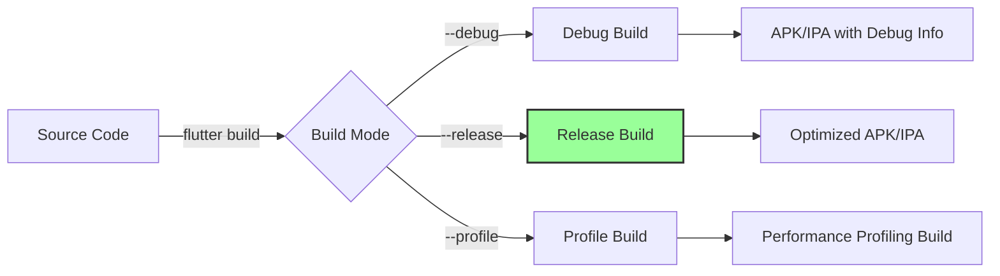
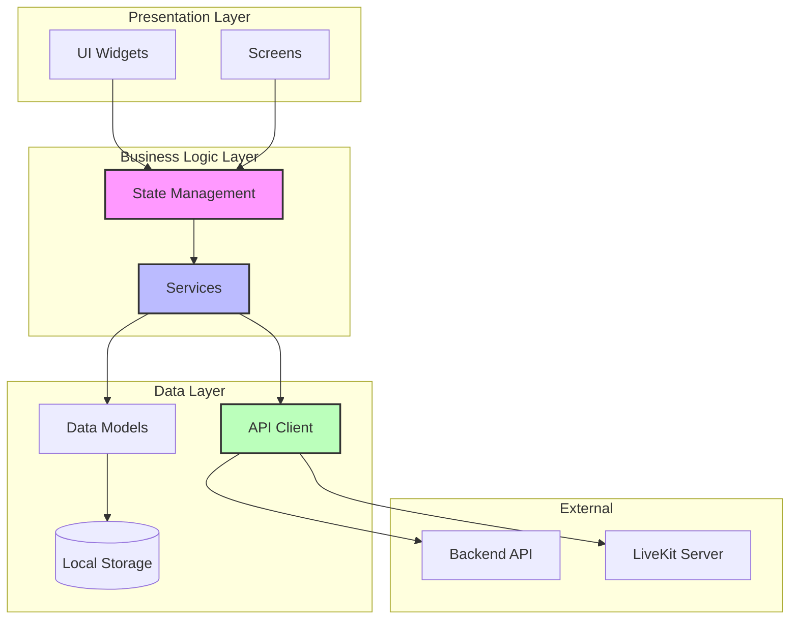

# OmniCaller Client

Flutter mobile application for OmniCaller - Real-time communication platform with WebRTC support.

## Table of Contents

- [Overview](#overview)
- [Features](#features)
- [Requirements](#requirements)
- [Installation](#installation)
- [Configuration](#configuration)
- [Development](#development)
- [Building](#building)
- [Testing](#testing)
- [Architecture](#architecture)
- [Project Structure](#project-structure)
- [Troubleshooting](#troubleshooting)

## Overview

OmniCaller Client is a cross-platform mobile application built with Flutter, providing real-time audio/video communication capabilities using WebRTC and LiveKit.

## Features

- Real-time audio and video calling
- WebRTC-based peer-to-peer communication
- LiveKit integration for signaling
- Modern Material Design UI
- Cross-platform support (iOS and Android)

## Requirements

### Development Environment

- Flutter SDK 3.24.5 or higher
- Dart SDK 3.5.4 or higher
- Android Studio / Xcode (for platform-specific builds)

### Android Development

- Android SDK 21 or higher
- Android Studio Arctic Fox or higher
- Java 11 or higher

### iOS Development

- macOS 12.0 or higher
- Xcode 14.0 or higher
- CocoaPods 1.11.0 or higher

## Installation

### 1. Install Flutter

Follow the official Flutter installation guide: [Docs Flutter](https://docs.flutter.dev/get-started/install)

### 2. Clone Repository

```bash
git clone <repository-url>
cd OmniCaller/client
```

### 3. Install Dependencies

```bash
flutter pub get
```

### 4. Verify Installation

```bash
flutter doctor
```

Ensure all checks pass before proceeding.

## Configuration

### Environment Configuration

Create a configuration file for API endpoints:

```dart
// lib/config/app_config.dart
class AppConfig {
  static const String apiBaseUrl = 'https://api.your-domain.com';
  static const String livekitUrl = 'wss://livekit.your-domain.com';
}
```

### Android Configuration

Update `android/app/src/main/AndroidManifest.xml`:

```xml
<manifest>
    <uses-permission android:name="android.permission.INTERNET" />
    <uses-permission android:name="android.permission.CAMERA" />
    <uses-permission android:name="android.permission.RECORD_AUDIO" />
    <uses-permission android:name="android.permission.MODIFY_AUDIO_SETTINGS" />

    <application
        android:label="OmniCaller"
        android:icon="@mipmap/ic_launcher">
        <!-- ... -->
    </application>
</manifest>
```

### iOS Configuration

Update `ios/Runner/Info.plist`:

```xml
<dict>
    <key>NSCameraUsageDescription</key>
    <string>OmniCaller needs camera access for video calls</string>
    <key>NSMicrophoneUsageDescription</key>
    <string>OmniCaller needs microphone access for audio calls</string>
</dict>
```

## Development

### Run Development Build

```bash
# Android
flutter run

# iOS
flutter run

# Specific device
flutter run -d <device-id>
```

### Hot Reload

Press `r` in the terminal to hot reload changes.

Press `R` to hot restart the application.

### Debug Mode

```bash
flutter run --debug
```

### Check for Issues

```bash
flutter analyze
```

## Building

### Android

#### Debug APK

```bash
flutter build apk --debug
```

Output: `build/app/outputs/flutter-apk/app-debug.apk`

#### Release APK

```bash
flutter build apk --release
```

Output: `build/app/outputs/flutter-apk/app-release.apk`

#### App Bundle (for Google Play)

```bash
flutter build appbundle --release
```

Output: `build/app/outputs/bundle/release/app-release.aab`

#### Rename Release APK

```bash
cd build/app/outputs/flutter-apk
cp app-release.apk OmniCaller-v1.0.0-release.apk
```

### iOS

#### Debug Build

```bash
flutter build ios --debug
```

#### Release Build

```bash
flutter build ios --release
```

#### Create IPA

```bash
flutter build ipa --release
```

Output: `build/ios/ipa/`

### Build Configuration



## Testing

### Unit Tests

```bash
flutter test
```

### Widget Tests

```bash
flutter test test/widget_test.dart
```

### Integration Tests

```bash
flutter test integration_test/
```

### Test Coverage

```bash
flutter test --coverage
```

View coverage report:

```bash
genhtml coverage/lcov.info -o coverage/html
open coverage/html/index.html
```

## Architecture

### Application Architecture



### Key Components

- **Presentation Layer**: UI widgets and screens
- **State Management**: Application state handling (Provider/Riverpod/Bloc)
- **Services**: Business logic and data operations
- **API Client**: HTTP communication with backend
- **Models**: Data structures and serialization
- **Local Storage**: Persistent data storage

## Project Structure

```txt
client/
├── android/                          # Android native code
│   ├── app/
│   │   ├── src/main/
│   │   │   ├── AndroidManifest.xml
│   │   │   └── kotlin/
│   │   └── build.gradle
│   └── build.gradle
├── ios/                              # iOS native code
│   ├── Runner/
│   │   ├── Info.plist
│   │   └── AppDelegate.swift
│   └── Podfile
├── lib/                              # Dart source code
│   ├── main.dart                     # Application entry point
│   ├── config/                       # Configuration files
│   ├── models/                       # Data models
│   ├── services/                     # Business logic services
│   ├── screens/                      # UI screens
│   ├── widgets/                      # Reusable widgets
│   ├── utils/                        # Utility functions
│   └── theme/                        # App theming
├── test/                             # Unit and widget tests
├── integration_test/                 # Integration tests
├── assets/                           # Static assets
│   ├── images/
│   ├── fonts/
│   └── icons/
├── build/                            # Build outputs
│   └── app/
│       └── outputs/
│           └── flutter-apk/
│               └── app-release.apk
├── pubspec.yaml                      # Dependencies and metadata
├── analysis_options.yaml             # Linter configuration
└── README.md                         # This file
```

## Dependencies

### Core Dependencies

```yaml
dependencies:
   flutter:
      sdk: flutter
   livekit_client: ^latest # WebRTC and LiveKit integration
   http: ^latest # HTTP client
   provider: ^latest # State management
   shared_preferences: ^latest # Local storage
```

### Development Dependencies

```yaml
dev_dependencies:
   flutter_test:
      sdk: flutter
   flutter_lints: ^latest # Linting rules
   build_runner: ^latest # Code generation
```

## Troubleshooting

### Flutter Doctor Issues

```bash
# Run doctor with verbose output
flutter doctor -v

# Fix Android licenses
flutter doctor --android-licenses
```

### Build Failures

#### Clear Build Cache

```bash
flutter clean
flutter pub get
flutter build apk --release
```

#### Gradle Issues (Android)

```bash
cd android
./gradlew clean
cd ..
flutter build apk
```

#### CocoaPods Issues (iOS)

```bash
cd ios
pod deintegrate
pod install
cd ..
flutter build ios
```

### Dependency Conflicts

```bash
# Update dependencies
flutter pub upgrade

# Get specific version
flutter pub get
```

### Hot Reload Not Working

1. Stop the app
2. Run `flutter clean`
3. Run `flutter pub get`
4. Restart the app

### Performance Issues

```bash
# Build in profile mode
flutter run --profile

# Analyze performance
flutter run --profile --trace-skia
```

### Common Errors

#### Error: Gradle build failed

Solution:

```bash
cd android
./gradlew clean
cd ..
flutter clean
flutter pub get
```

#### Error: CocoaPods not installed

Solution:

```bash
sudo gem install cocoapods
pod setup
```

#### Error: SDK version mismatch

Solution: Update `pubspec.yaml` with correct Flutter/Dart SDK constraints:

```yaml
environment:
   sdk: '>=3.0.0 <4.0.0'
   flutter: '>=3.24.0'
```

## Code Quality

### Linting

```bash
flutter analyze
```

### Formatting

```bash
# Check formatting
flutter format --set-exit-if-changed .

# Apply formatting
flutter format .
```

### Static Analysis

Configure `analysis_options.yaml`:

```yaml
include: package:flutter_lints/flutter.yaml

linter:
   rules:
      - prefer_const_constructors
      - avoid_print
      - prefer_single_quotes
```

## Distribution

### Distribution Android

#### Sideload Installation

1. Enable "Install from Unknown Sources" on device
2. Transfer APK to device
3. Open APK file and install

#### Google Play Store

1. Build App Bundle: `flutter build appbundle --release`
2. Sign with release keystore
3. Upload to Google Play Console
4. Complete store listing
5. Submit for review

### Distribution iOS

#### TestFlight

1. Build IPA: `flutter build ipa --release`
2. Upload to App Store Connect
3. Submit to TestFlight
4. Invite testers

#### App Store

1. Complete app review information
2. Submit for App Store review
3. Wait for approval
4. Release to App Store

## Versioning

Update version in `pubspec.yaml`:

```yaml
version: 1.0.0+1
# Format: major.minor.patch+buildNumber
```

Build with version:

```bash
flutter build apk --release --build-name=1.0.0 --build-number=1
```

## Resources

### Flutter Documentation

- Official Documentation: [Docs Flutter](https://docs.flutter.dev/)
- API Reference: [API Reference Flutter](https://api.flutter.dev/)
- Package Repository: [Package Repository Flutter](https://pub.dev/)

### Learning Resources

- Flutter Codelabs: [Flutter Codelabs](https://docs.flutter.dev/codelabs)
- Flutter Samples: [Flutter Samples](https://flutter.github.io/samples/)
- Flutter YouTube: [Flutter YouTube](https://www.youtube.com/flutterdev)

### Community

- Stack Overflow: [Stack Overflow](https://stackoverflow.com/questions/tagged/flutter)
- GitHub Issues: [GitHub Issues](https://github.com/flutter/flutter/issues)
- Discord Community: [Discord Community](https://discord.gg/flutter)

## Contributing

1. Fork the repository
2. Create a feature branch (`git checkout -b feature/amazing-feature`)
3. Follow Flutter style guide
4. Write tests for new features
5. Ensure all tests pass (`flutter test`)
6. Run linter (`flutter analyze`)
7. Format code (`flutter format .`)
8. Commit changes (`git commit -m 'Add amazing feature'`)
9. Push to branch (`git push origin feature/amazing-feature`)
10.   Open a Pull Request

## License

This project is proprietary software. All rights reserved.

## Support

For issues, questions, or contributions, please refer to the main project documentation or contact the development team.
