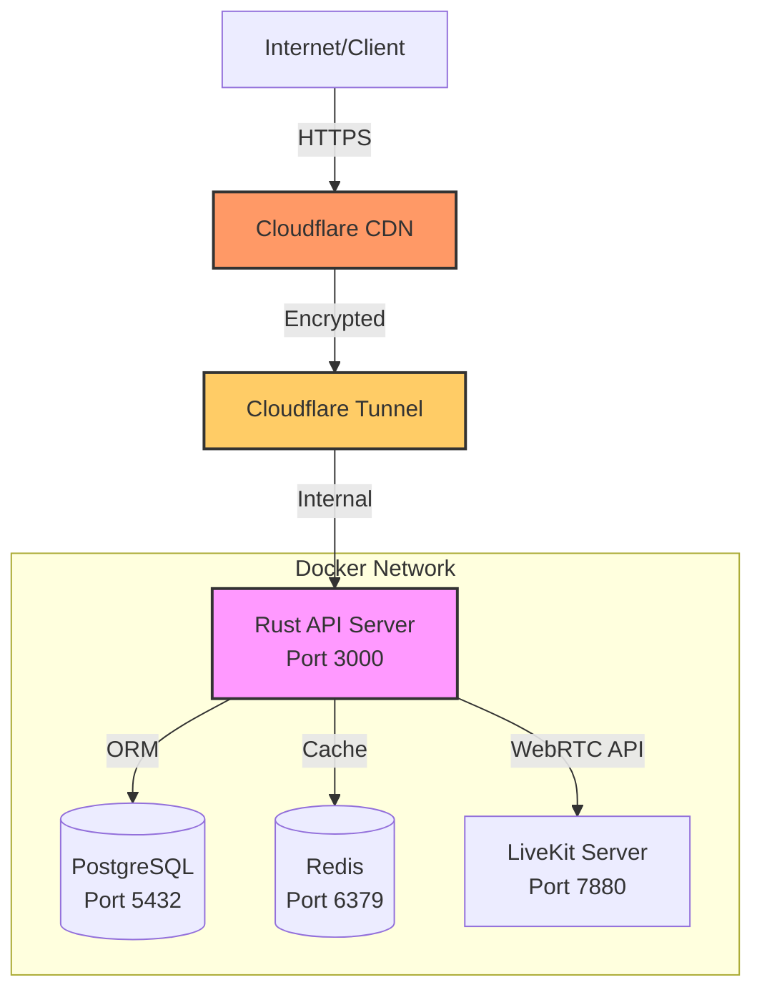

# OmniCaller Server

Backend API server for OmniCaller - Real-time communication platform with WebRTC.

## Table of Contents

- [Quick Start](#quick-start)
- [Tech Stack](#tech-stack)
- [Architecture](#architecture)
- [Services](#services)
- [Environment Setup](#environment-setup)
- [Development](#development)
- [API Endpoints](#api-endpoints)
- [Monitoring](#monitoring)
- [Troubleshooting](#troubleshooting)
- [Security](#security)
- [Production Deployment](#production-deployment)

## Quick Start

```bash
# Automatic setup
./setup.sh
```

## Tech Stack

- **Language**: Rust 2021
- **Framework**: Axum 0.7
- **Database**: PostgreSQL 17 with Sea-ORM
- **Cache**: Redis
- **WebRTC**: LiveKit
- **Tunnel**: Cloudflare Tunnel
- **Container**: Docker + Docker Compose

## Architecture



## Services

| Service     | Port | Description              |
| ----------- | ---- | ------------------------ |
| Server      | 3000 | Rust API server          |
| PostgreSQL  | 5432 | Primary database         |
| Redis       | 6379 | Cache and session store  |
| LiveKit     | 7880 | WebRTC signaling server  |
| Cloudflared | -    | Cloudflare Tunnel client |

## Environment Setup

### 1. Copy Environment Template

```bash
cp .env.example .env
```

### 2. Generate Secrets

```bash
# Generate JWT secret
openssl rand -base64 48

# Generate database password
openssl rand -base64 32
```

### 3. Configure Cloudflare

1. Visit Cloudflare Dashboard: [Cloudflare](https://one.dash.cloudflare.com/)
2. Navigate to Zero Trust > Tunnels
3. Create new tunnel and copy the token
4. Update `.env` with the token

### 4. Update Environment File

Edit `.env` with your configuration:

```bash
nano .env
```

Required variables:

- `JWT_SECRET`
- `DATABASE_URL`
- `REDIS_URL`
- `LIVEKIT_API_KEY`
- `LIVEKIT_API_SECRET`
- `CLOUDFLARE_TUNNEL_TOKEN`

## Commands

```bash
# Display all available commands
make help

# Service management
make up                # Start all services
make down              # Stop all services
make restart           # Restart all services
make logs              # View all logs
make logs-server       # View server logs only
make logs-cloudflared  # View tunnel logs only

# Health checks
make health            # Quick health check
./health-check.sh      # Detailed health check

# Development
make rebuild-server    # Rebuild server container
make shell-server      # Access server shell
make shell-postgres    # Access PostgreSQL shell

# Database
make backup-db         # Backup database
make restore-db        # Restore database
```

## Development

### Development Mode with Hot-Reload

```bash
docker-compose -f docker-compose.yml -f docker-compose.dev.yml up
```

### Access Database UI (Adminer)

```bash
open http://localhost:8080
```

Credentials:

- System: PostgreSQL
- Server: postgres
- Username: (from .env)
- Password: (from .env)
- Database: omnicaller

### Running Tests

```bash
# Inside container
make shell-server
cargo test

# Or directly
docker exec omni-caller-server cargo test
```

## API Endpoints

### Health Check

```bash
# Local
curl http://localhost:3000/health

# Via Cloudflare Tunnel
curl https://api.your-domain.com/health
```

### API Documentation

When server is running, visit:

- Swagger UI: `http://localhost:3000/swagger-ui`
- OpenAPI JSON: `http://localhost:3000/api-doc/openapi.json`

## Monitoring

### Health Check Script

```bash
./health-check.sh
```

This script checks:

- Server HTTP endpoint
- Database connectivity
- Redis connectivity
- LiveKit server status
- Cloudflare Tunnel status

### View Logs

```bash
# All services
make logs

# Specific service
make logs-server
make logs-postgres
make logs-redis
make logs-livekit
make logs-cloudflared

# Follow logs in real-time
docker-compose logs -f
```

### Container Statistics

```bash
docker stats
```

## Troubleshooting

### Server Not Starting

```bash
# Check logs
make logs-server

# Rebuild container
make rebuild-server

# Restart service
docker-compose restart server
```

### Cloudflare Tunnel Not Connecting

```bash
# Check tunnel logs
make logs-cloudflared

# Verify token in .env
cat .env | grep CLOUDFLARE_TUNNEL_TOKEN

# Restart tunnel
docker-compose restart cloudflared
```

### Database Connection Issues

```bash
# Check PostgreSQL logs
make logs-postgres

# Access database shell
make shell-postgres

# Restart database
docker-compose restart postgres
```

### Port Already in Use

```bash
# Find process using port
lsof -i :3000

# Kill process
kill -9 <PID>
```

For more troubleshooting tips, see [DOCKER_README.md](./DOCKER_README.md#troubleshooting).

## Security

### Security Features

- Non-root container user for all services
- Auto-generated secrets during setup
- Environment-based configuration (no hardcoded credentials)
- Cloudflare Tunnel (no exposed ports to internet)
- Health checks for all critical services
- `.gitignore` configured for sensitive files

### Security Checklist

- [ ] Change all default passwords
- [ ] Use strong JWT secret (minimum 48 characters)
- [ ] Enable Cloudflare WAF
- [ ] Configure rate limiting
- [ ] Enable HTTPS only
- [ ] Review database access permissions
- [ ] Enable audit logging
- [ ] Set up monitoring alerts

## Production Deployment

### Pre-deployment Checklist

1. Set `APP_ENV=production` in `.env`
2. Generate strong secrets for production
3. Configure production database credentials
4. Set up Cloudflare Tunnel with production domain
5. Review and update CORS settings
6. Configure logging level
7. Set up backup strategy

### Deployment Steps

```bash
# 1. Pull latest code
git pull origin main

# 2. Build production images
docker-compose build --no-cache

# 3. Start services
make prod

# 4. Verify deployment
./health-check.sh
```

### Post-deployment

1. Configure Cloudflare WAF rules
2. Set up rate limiting
3. Enable monitoring and alerts
4. Configure automated backups
5. Test all critical endpoints
6. Monitor logs for errors

## File Structure

```txt
server/
├── src/                              # Rust source code
│   ├── main.rs                       # Application entry point
│   ├── routes/                       # API route handlers
│   ├── models/                       # Database models
│   ├── services/                     # Business logic
│   └── utils/                        # Utility functions
├── migrations/                       # Database migrations
├── Dockerfile                        # Production container build
├── docker-compose.yml                # Production services
├── docker-compose.dev.yml            # Development overrides
├── .env.example                      # Environment template
├── Makefile                          # Management commands
├── setup.sh                          # Automated setup script
├── health-check.sh                   # Health check script
├── livekit.yaml                      # LiveKit configuration
├── cloudflared-config.example.yml    # Cloudflare Tunnel template
└── docs/                             # Additional documentation
    ├── QUICKSTART.md
    ├── DOCKER_README.md
    ├── CLOUDFLARE_SETUP.md
    └── DEPLOYMENT_SUMMARY.md
```

## Database Backup and Restore

### Backup

```bash
# Automatic backup with timestamp
make backup-db

# Manual backup
docker exec omni-caller-postgres pg_dump -U postgres omnicaller > backup.sql
```

### Restore

```bash
# From backup file
make restore-db FILE=backup_20261007_120000.sql

# Manual restore
docker exec -i omni-caller-postgres psql -U postgres omnicaller < backup.sql
```

## Contributing

1. Fork the repository
2. Create a feature branch (`git checkout -b feature/amazing-feature`)
3. Commit your changes (`git commit -m 'Add amazing feature'`)
4. Test locally with `make dev`
5. Push to the branch (`git push origin feature/amazing-feature`)
6. Open a Pull Request

## License

This project is proprietary software. All rights reserved.

## Support

- **Quick Start Guide**: [QUICKSTART.md](./QUICKSTART.md)
- **Full Documentation**: [DOCKER_README.md](./DOCKER_README.md)
- **Commands Reference**: `make help`
- **Health Check**: `./health-check.sh`
